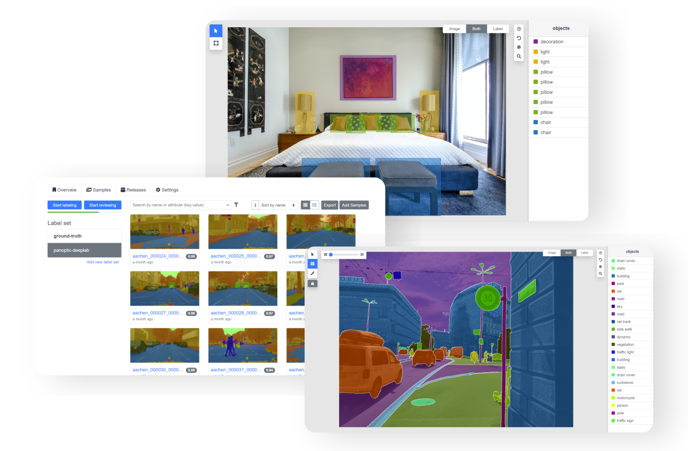

# Segments.ai Python SDK

[Segments.ai](https://segments.ai/) is the training data platform for computer vision engineers and labeling teams. Our powerful labeling interfaces, easy-to-use management features, and extensive API integrations help you iterate quickly between data labeling, model training and failure case discovery.

## Quickstart

Walk through [the Python SDK quickstart](https://docs.segments.ai/tutorials/python-sdk-quickstart).

## Documentation

Please refer to [the documentation](http://segments-python-sdk.rtfd.io/) for usage instructions.
